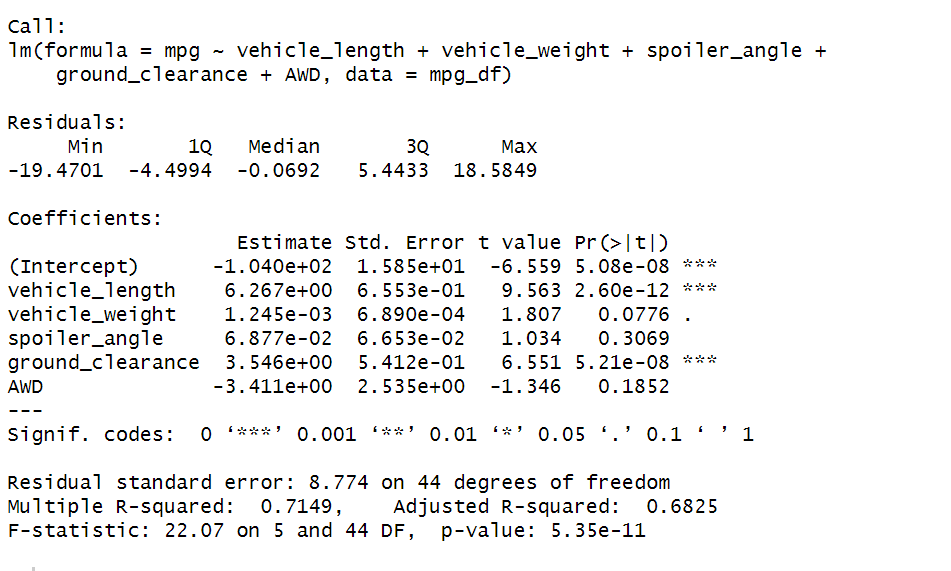

# MechaCar_Statistical_Analysis

## Linear Regression to Predict MPG

A linear model was created by entering five predicting variables including vehicle Length, vehicle weight, spoiler angle, ground clearance, AWD to predict vehicle's MPG. As shown below, the results of the multiple regression analysis indicate that two of the predictors, namely, vehicle length and ground clearance are significantly related to MPG (p-value < 0.001) while the other three predictors' relationship with MPG is nonsignificant. 

R-Squared: 0.71, this means the model can predict an acceptable portion of MPG data points based on the independent variables that takedn into consideration.
P-value: Almost 0, means H0 is rejected and at least one of the variables slope is not zero.
Vehicle Weight, Spoiler Angle, and AWD are not statistically significant and can be neglected in next model.

## Summary Statistics on Suspension Coils

## T-Tests on Suspension Coils
