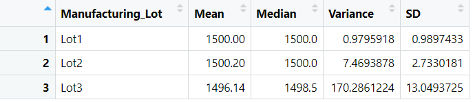
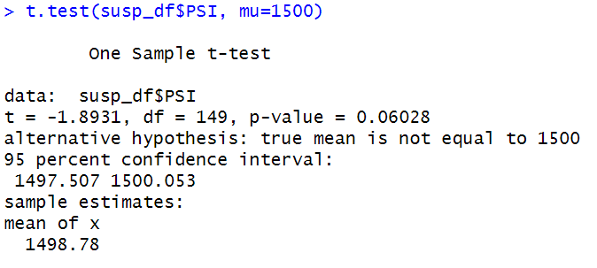
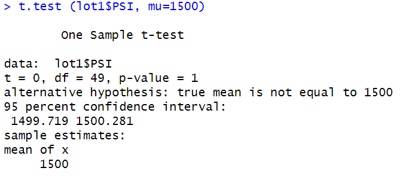
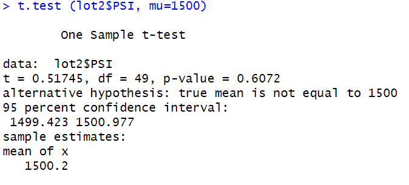
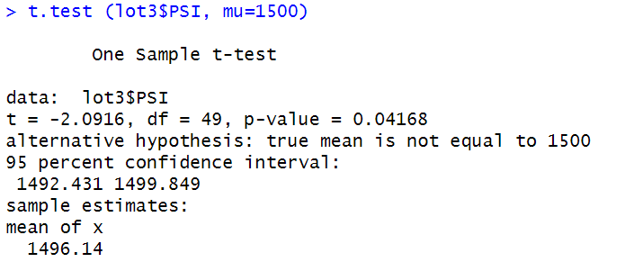

# MechaCar_Statistical_Analysis

## Linear Regression to Predict MPG

A linear model was created by entering five predicting variables including vehicle Length, vehicle weight, spoiler angle, ground clearance, AWD to predict vehicle's MPG. As shown below, the results of the multiple regression analysis indicate that two of the predictors, namely, vehicle length and ground clearance are significantly related to MPG (p-value < 0.001) while the other three predictors' relationship with MPG is nonsignificant. 

The F-statistic (22.07) and p-value (<0.001) associated with the multiple regression model indicates the statistical significance of the overall model. That is, the slope of the linear model is significantly different from zero.

The linear model explains almost 70 percent of the variance in the dependent variable (i.e., MPG) with R-Squared equalt to 0.71 and adjusted R-squared of 0.68. The observed results implies high predictive power of this model.

## Summary Statistics on Suspension Coils

As shown below, the varaince calcualted for the entire dataset (Total Summary Table) is equal to 62.3 which is less than 100 and thus meets the specified design constrait. However, when we dig into the dataset by breaking that the anlaysis to specific lots, we realize that while lot 1 and lot 2 meet the desing consideration (variance of lot1 and lot equal to 0.98 and 7.47 respectively), variance of the suspension coils related to vehicle manufactured in lot3 are above 100 (variance = 170.29). That means, among the three lots, only lots 1 and 2 meet the design threshold.

### Total Summary

### Lot Summary

## T-Tests on Suspension Coils

In this part four different t-tests has been executed and the result are as below. H0: There is no difference between the mean of data and population mean. Alpha = 0.05.

The first t-test was run to compare the means between the entire cases in the dataset and the assumed population mean of 1500.
As shown below, the null hypothesis of the equal mean value was not rejected (t = -1.8931, df = 149, p-value = 0.06028) under the 95 percent cofidence interval. That is, statistically, there is no significant difference between the dataset mean and 1500.

The second t-test was run to compare the means between PSI of the vehicles manufactured in lot1 and the assumed population mean of 1500.
As shown below, the null hypothesis of the equal mean value was not rejected (t = 0, df = 49, p-value = 1) under the 95 percent cofidence interval. That is, statistically, there is no significant difference between the mean value of PSI related to vehicles manufacturted at lot1 are significantly different from the population mean value of 1500.

The third t-test was run to compare the means between PSI of the vehicles manufactured in lot2 and the assumed population mean of 1500.
As shown below, the null hypothesis of the equal mean value was not rejected (t = 0.51745, df = 49, p-value = 0.6072) under the 95 percent cofidence interval. That is, statistically, there is no significant difference between the mean value of PSI related to vehicles manufacturted at lot2 and the population mean value of 1500.

The fourth t-test was run to compare the means between PSI of the vehicles manufactured in lot3 and the assumed population mean of 1500.
As shown below, the null hypothesis of the equal mean value was rejected (t = -2.0916, df = 49, p-value = 0.04168) under the 95 percent cofidence interval. That is, statistically, the mean value of PSI related to vehicles manufacturted at lot3 are significantly different from the population mean value of 1500.

